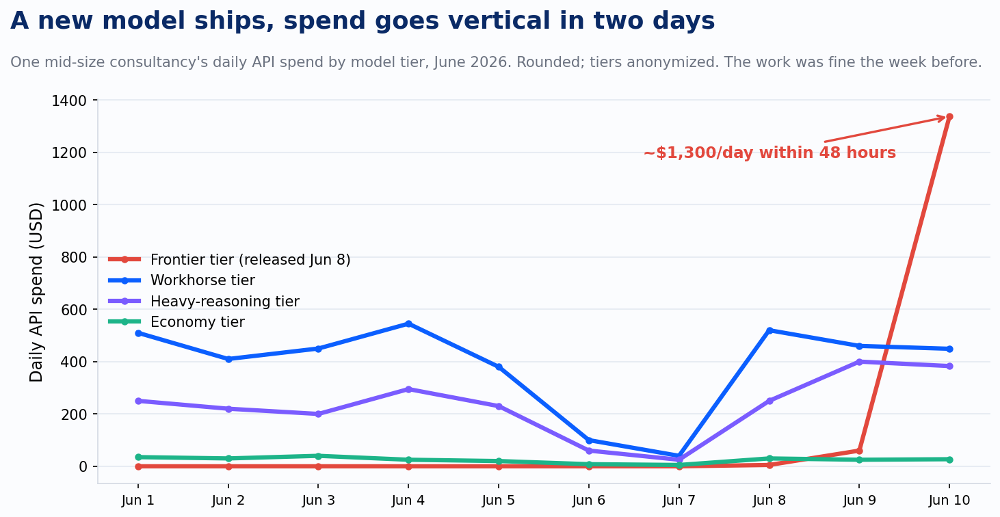
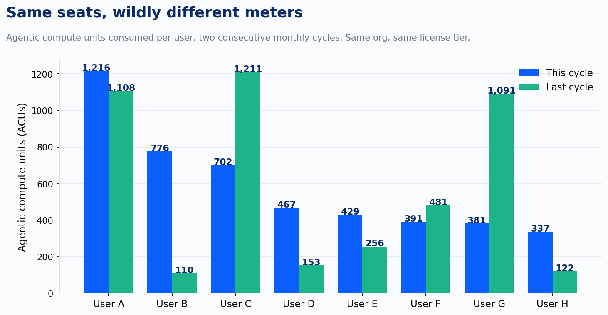
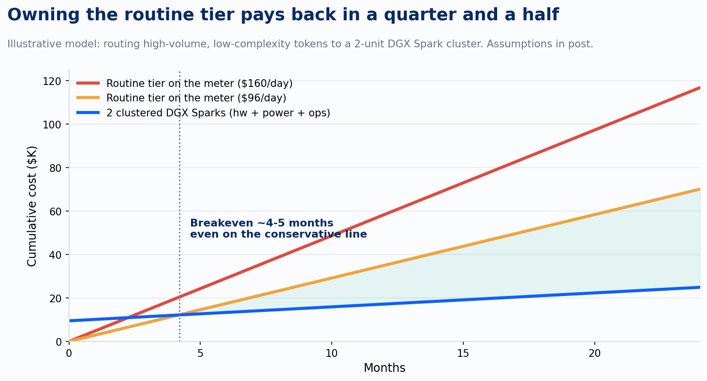

[AI Economics](/tag/ai-economics/)

# The Meter Picks the Winners

Model selection, problem selection, and the economics underneath them are going to pick the winners and losers of the agentic era. The meter is just the scorekeeper.

-   

#### [Devlin Liles](/author/devlin/)

12 Jun 2026 • 10 min read

[Share](#/share)

Pull up your organization's AI spend console and sort by model, by day. Not by month. Monthly aggregates hide the thing you need to see.

Here is what one console I watch every morning showed this week. A new frontier-tier model shipped on a Monday. By Wednesday it was burning roughly $1,300 a day, more than the workhorse, heavy-reasoning, and economy tiers combined. Nobody mandated the migration. Nobody ran a procurement cycle. Nobody ran an eval, either. A few hundred practitioners moved the day it appeared, and the work was getting done fine the week before. Forty-eight hours from release to the largest line on the meter, and the price never entered the decision.

Hold that picture against what the vendors spent this spring telling us. A frontier lab closed the loophole that let autonomous agents ride flat-rate subscriptions, and developers staring at cost increases of up to 50x went hunting for workarounds. They did not walk away. That is the tell: the value had already become a dependency. GitHub moved to full token-based billing June 1 after admitting that a handful of agentic requests now routinely exceeds a monthly plan price. And Satya Nadella told analysts on Microsoft's Q3 FY2026 earnings call: "Any per-user business of ours — whether it's productivity, coding, security — will become a per-user and usage business."

Read those three events as one sentence. Flat-rate pricing was a customer-acquisition cost, and the acquisition is complete. Every seat-based AI product you run today is a meter wearing a subscription costume, and the costume comes off at your next renewal.

So the meter is coming. Settled. The interesting question is who the meter will reward, and the console answers it. Three patterns stand out, and together they make the claim this post exists for: model selection, problem selection, and the economics underneath them are going to pick the winners and losers of this era. The meter is just the scorekeeper.

## Three patterns in the usage data

**Spend follows the new shiny, with zero lag and zero price check.** The uncomfortable part of that spike: we were doing fine before the model came out. The workhorse tier was clearing the same workload the week before at a fraction of the cost. Nothing about the work changed on Monday. The model did, and it costs exactly double per token what the previous flagship costs. Adoption ran ahead of evaluation, because at the front line, model targeting is nobody's job. No practitioner asked whether the new model cleared a quality bar the old one missed, and no practitioner asked what it cost, because cost only reaches the front line as a ceiling somebody set in an admin console. A ceiling is a brake. A rubric is a steering wheel. Right now most organizations are driving with one and without the other. Plan on this: every model release from here forward is a same-week pricing event for your budget, whether or not anyone announces a price change.

**Same seats, wildly different meters.** Look at agentic compute consumption per user across two consecutive monthly cycles in one org, same license tier on every seat.

The top seat consumed eleven times the bottom seat this cycle. One user went from 110 units to 776, a 7x jump in thirty days. Another dropped from 1,091 to 381. Headcount predicts none of this. Effort and seniority predict none of this. The meter measures one thing: what each person pointed the agent at. Some of that burn is task-level labor compression that returns multiples of its cost. Some of it is toy usage paying the look-at-me tax. Today those two are indistinguishable on the invoice, and that is precisely the problem.

**The economy tier is flat.** While the workhorse tier ran around $450 a day, the cheapest tier idled under $30. Routine work that a small model handles at one-fifteenth the price is riding expensive models by default, because nobody wrote the rubric that says which task earns which model. Routing discipline is the cheapest optimization available in enterprise AI right now, and almost nobody is doing it deliberately.

Put these three patterns against the eight-stage maturity model we use at Improving. Stages 1 through 3 are individual skill, and the Stage 3 exit criterion is a written evaluation rubric: you can tell improvement from drift because you measure. That same artifact is a routing artifact. A rubric that defines what good output looks like for a task also tells you the cheapest model that clears the bar. Stage 4, Workflow, is the wall, and it is a wall for cost the same way it is a wall for reliability. Errors compound per step, and so does overpayment. A twenty-step workflow on the wrong model tier overpays twenty times per run, times every run, every day, silently. The boxes are where AI helps. The arrows are where the meter compounds.

## The rate card never moved. Your price did.

Three dials set what you actually pay for these models, and the rate card is the only one you can see. It is also the least interesting of the three, because it is the one dial the vendor turns in public.

The second dial is the tokenizer. When the April flagship shipped, it carried a new tokenizer, the invisible function that decides how many tokens your text becomes. The rate card stayed at $5 per million in, $25 per million out. The same paragraph of prose, the same Python function, the same JSON payload now breaks into up to a third more tokens than it did on the prior version, with code, structured data, and non-English text hit hardest. Some teams measured worse. Imagine your power utility holding the per-kilowatt-hour rate flat and quietly redefining the kilowatt. That is an effective price increase of up to 35% that produced no announcement, no line item, and no renewal conversation. It just arrived in the bill.

The third dial is the flagship ladder. The new frontier tier launched at $10 in and $50 out per million tokens, exactly double the previous flagship. The vendor's pitch is that it finishes work in fewer turns and fewer tokens, so the effective cost lands closer than the sticker suggests. That is a claim, made by the party that sets the price, measured on workloads the party chose. Treat it the way you treat the fuel-economy sticker at the dealership. It might hold for your workload. Nobody at your front line has measured whether it does, and until someone does, the only verified number in this paragraph is the rate card: 2x.

Now compound the dials. Take a workflow that ran on the old flagship in March. The tokenizer adds roughly a third more tokens for the same text. The voluntary migration to the new tier doubles the rate. Same work, call it 2.7x the cost, ninety days later, and not one of those dollars came from a price change anyone announced. The chart at the top of this post shows the migration happening in 48 hours, unforced, at double the per-token price. The dials turn, and consumption runs toward them.

If you are making operations dependent on these models, and the dependency data says you already are, then pricing control graduates from procurement detail to operational discipline, the same class as uptime and security. You would never run production on a database whose vendor could silently redefine what counts as a row. You are running production workflows on models whose vendors can silently redefine what counts as a token, reprice the flagship 2x, and rely on your own practitioners to migrate the spend for them. Dollars per token is now a vanity metric. Cost per unit of finished work is the only denominator the vendor cannot quietly move, because you own both sides of it.

## The floor you can own

Some of this consumption does not have to ride a meter at all.

We run two Nvidia DGX Sparks clustered over a single 200GbE cable. The pair cost $9,398 at current list ($4,699 each; the founders units went for $3,999). Linked, they pool 256GB of unified memory, enough to serve 120B-parameter open models at 55 to 75 tokens per second interactive, and around 550 tokens per second batched. Translate that: at a conservative 25% average utilization, the pair produces roughly 12 million output tokens a day. That is the routine tier of a few hundred knowledge workers. Classification, summarization, extraction, document drafting, retrieval grounding. The steady hum, off the meter.

The deferral math, with every assumption labeled. If those tokens were displacing economy-tier API pricing ($1 per million in, $5 per million out, at a 3:1 input ratio), the pair defers about $96 a day, $35,000 a year. If a slice of workhorse-tier routine traffic routes there too, call it $160 a day, $58,000 a year. Against that: $9,398 in hardware, about $530 a year in power (400W sustained at $0.15/kWh), and roughly $7,200 a year in care and feeding (four hours a month of engineer time at a loaded $150 an hour, running a free software stack: vLLM or llama.cpp behind a LiteLLM router). Breakeven lands around month four on the conservative line. From year two forward, the pair costs $7,700 a year to run against $35,000 to $58,000 of deferred spend.

Before anyone sprints to procurement: owned silicon is not magic either. Hosted open-model endpoints sell 120B-class tokens for dimes per million, and on pure dollars-per-token they beat a box sitting at 25% utilization. The Sparks buy four things the hosted endpoint does not. A fixed ceiling, because capex does not spike when someone discovers a new workflow. Data that never leaves the building. A standing laboratory where your team builds the routing muscle that Stage 3 and Stage 4 demand. And a number in your pocket at renewal time, because the organization with a working alternative negotiates differently than the organization with a dependency. There is a fifth thing, sharper after the tokenizer episode: a denominator nobody else can redefine. On your own silicon, the tokenizer, the model version, and the cost per watt all hold still until you decide to change them. That stability is what makes your unit-of-work measurements trustworthy enough to govern the metered spend with.

Notice what stays on the meter: the frontier tier. Some of that $1,300 a day is buying reasoning no open model ships today. Some of it is the new shiny doing work the workhorse tier handled fine ten days ago. Until somebody writes the rubric, the invoice cannot tell you which dollar is which. The principle still holds: pay the premium where the premium pays, own the floor underneath it. Earning the right to say "where the premium pays" takes measurement nobody at the front line is doing today.

## What to do about it

**If you lead technology.** Instrument before the pricing changes, because the bill will reflect consumption that happened while you had no visibility. Get to per-workflow unit cost: what does a brief, an analysis, a resolved ticket cost in dollars, on which model, and track it in dollars per deliverable, because the tokenizer episode just proved that dollars per token is a number the vendor can move without telling you. Add a tripwire to your observability: when cost per deliverable jumps with no change on your side, a dial turned, and you want to know that week, in your dashboard, before the invoice tells you next month. Write the routing rubric that assigns each task class the cheapest model that clears its quality bar, and enforce it in the dispatcher, since asking politely does not survive contact with deadlines or a new release. You probably already have spend ceilings; keep them, and be honest that a ceiling only caps the damage. The rubric is what makes the spend correct. Stand up an owned floor, a Spark pair or equivalent, to build routing discipline and create the alternative. And before any autonomous workflow reaches production, give it its own ceiling, the same way Stage 4 requires punch-out points the AI cannot bypass. Homework with a deadline: within two weeks, pull daily spend by model, name your top ten consumers, and ask each one what problem they pointed the agent at. The answers will sort your labor compression from your look-at-me tax in a single meeting.

**If you run the business.** The seat cost is the wrong unit of analysis, and so is the meter. The right unit is task-level labor compression: what a unit of finished work costs before and after the agent. If AI acceleration delivers real throughput, a $300,000 attorney doing 40% more work against $3,000 of compute is the best workforce investment in the building. Hold that conditional, because "if" is doing real work in that sentence. Demand the unit math that proves it, because the budget conversation you want at renewal is workforce economics, and the one you will get by default is an IT cost overrun. Put consumption dollars in the P&L of the function capturing the value. The organization that walks into renewal saying "here is what every token bought" negotiates from strength. The organization that cannot is praying.

**If you do the work.** Your meter is about to become visible to the people who set budgets, and the variance chart above is what they will see. Be the seat whose consumption maps to outcomes. Learn model selection as a craft skill: match the model to the task, write down why, and keep the receipts when a cheaper tier clears your rubric. Today that skill is nobody's job at the front line, which makes it the fastest differentiation available. The practitioners who can say "I produce this deliverable for this much compute" will get more autonomy and bigger meters. The ones who cannot will get governance applied to them.

There is no light switch moment coming where this sorts itself out. The meter arrives on its own schedule, vendor by vendor, and it is indifferent to your readiness. Model selection, problem selection, and the economics underneath them are doing the picking already. The losers will discover what they depend on the day the subsidy ends. The winners will already know what every token bought.

* * *

_Sources: aggregated and anonymized organizational usage data, June 2026; Microsoft Q3 FY2026 earnings call; GitHub billing announcements, April 2026; published model rate cards and tokenizer-change analyses, April-June 2026; LMSYS DGX Spark review; StorageReview DGX Spark cluster benchmarks; Corti, "Two Sparks, One Cluster"; Nvidia DGX Spark marketplace pricing._